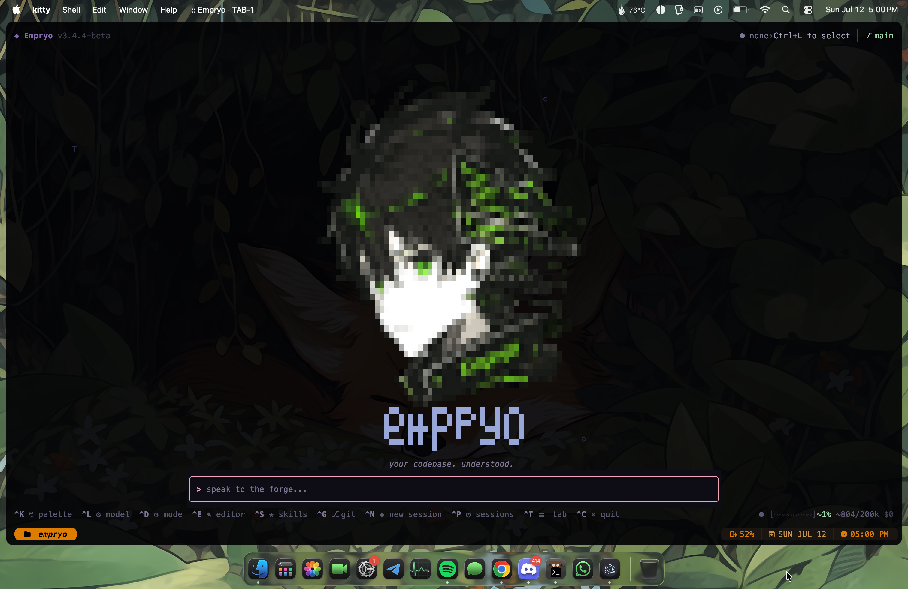
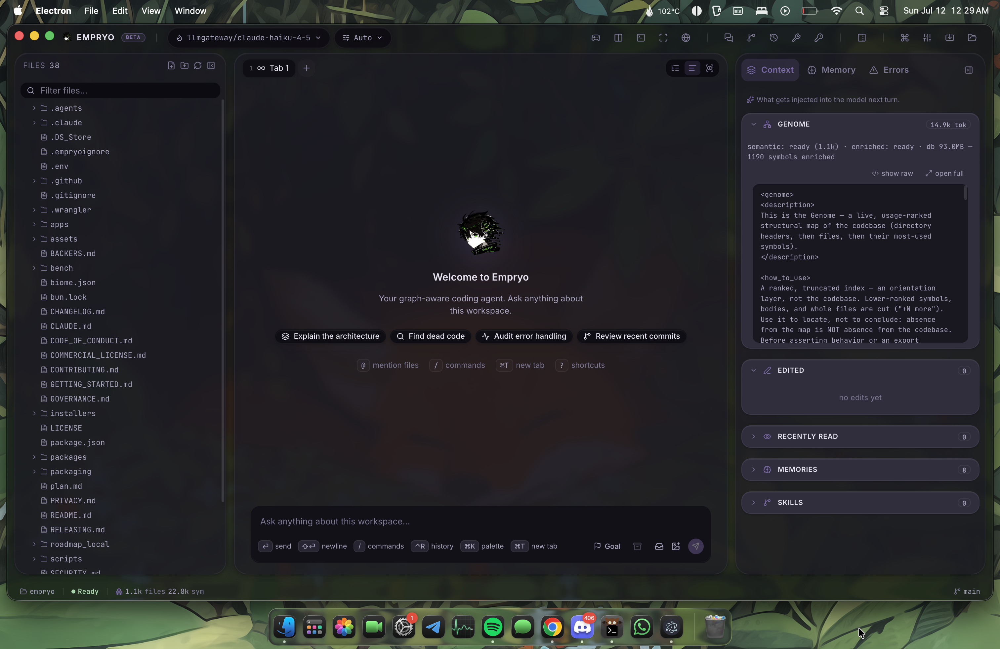

<div align="center">


# Empryo

<sub>previously **SoulForge**</sub>

**Graph-powered code intelligence — multi-agent coding with codebase-aware AI.**

[Website](https://empryo.com) · [Download](https://empryo.com/download) · [Changelog](https://empryo.com/changelog) · [Discussions](https://github.com/proxysoul/soulforge/discussions) · [Discord](https://discord.gg/fX4H7GYSMJ)



</div>

---

**SoulForge is now Empryo** — the same symbol-level, graph-powered agent, rebuilt with a desktop app, a faster engine, and a composable core. Development continues on Empryo; this repository is its home for issues and discussions.

## What is Empryo?

Empryo understands your codebase as a **graph**, not a pile of text. It parses your repo with tree-sitter, ranks symbols with PageRank and git co-change, and edits code at the **symbol level** — so it reads what matters and changes exactly what it means to.

It runs in a fast terminal UI, a native desktop app, and a scriptable headless mode. **Free to use** — bring your own provider key, or run fully local with Ollama. Your code never leaves your machine.

<div align="center">

</div>

| | |
|---|---|
| **Live code graph** | tree-sitter parse, PageRank + git co-change, blast-radius tags, FTS5 + trigram search |
| **Symbol-level editing** | AST edits via ts-morph (65+ ops, atomic batches) + structural edits across 30+ languages |
| **Multi-agent** | parallel explore/edit agents with a shared I/O cache |
| **Task router** | route each slot to a different model per tab — cheap to explore, strong to code |
| **Time machine** | every prompt is a checkpoint with a git tag; rewind and redo conversation *and* files |
| **22 providers** | Anthropic, OpenAI, Google, Groq, DeepSeek, Bedrock, Ollama, LM Studio … + any OpenAI-compatible |
| **Desktop app** | native window, embedded browser, and the full agent |
| **LSP + MCP** | 576+ language servers via Mason, any MCP server, 13 lifecycle hooks |

Runs on **macOS, Linux, and Windows**.

## Install

```bash
# macOS / Linux
curl -fsSL https://empryo.com/install.sh | bash

# Windows (PowerShell)
irm https://empryo.com/install.ps1 | iex
```

```bash
brew install proxysoul/tap/empryo
winget install ProxySoul.Empryo
```

Desktop app and prebuilt binaries: [empryo.com/download](https://empryo.com/download).

```bash
empryo --set-key anthropic sk-ant-...   # or run local with Ollama, no key
cd your-project
empryo
```

## Benchmarks

Same models, same repo, same tasks — Empryo's graph does more with less.

|  | Empryo | Pi |
|---|:---:|:---:|
| Bugs fixed | **8 / 9** | 7 / 9 |
| Cost | **$1.13** | $1.58 |
| Wall-clock | **4m 16s** | 10m 0s |
| Input tokens | **1.09M** | 6.21M |

Empryo navigates by symbols and call hierarchies instead of grep-and-read, so it takes fewer steps and burns fewer tokens. Full methodology and transcripts: [empryo.com/benchmarks](https://empryo.com/benchmarks) · reproduce it at [proxysoul/pi-vs-empryo-bench](https://github.com/proxysoul/pi-vs-empryo-bench).

## SoulForge

SoulForge remains available to download and install, and we'll keep fixing bugs and critical issues. New features and active development move to Empryo.

```bash
brew tap proxysoul/tap && brew install soulforge
# or
bun install -g @proxysoul/soulforge
```

## This repository

- **[Issues](https://github.com/proxysoul/soulforge/issues)** and **[Discussions](https://github.com/proxysoul/soulforge/discussions)** — the home for Empryo bug reports, questions, and ideas.
- The SoulForge source stays archived here under its existing license (see [`LICENSE`](LICENSE)).

## Sponsors

<div align="center">

<a href="https://llmgateway.io/dashboard?ref=6tjJR2H3X4E9RmVQiQwK" title="LLM Gateway">
  <picture>
    <source media="(prefers-color-scheme: dark)" srcset="assets/llmg-white.svg" />
    <source media="(prefers-color-scheme: light)" srcset="assets/llmg-dark.svg" />
    
  </picture>
</a>

<sub>One API, 200+ models, up to 30% off frontier. Wired in as the <code>llmgateway</code> provider.</sub>

<sub><a href="https://github.com/sponsors/proxysoul">Sponsor</a> · <a href="https://paypal.me/waeru">PayPal</a> · <a href="BACKERS.md">All backers</a></sub>

</div>
